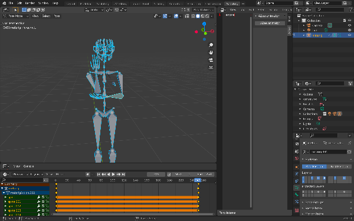
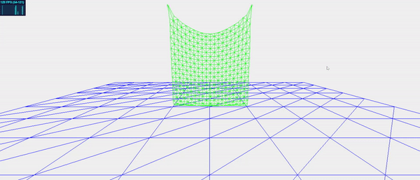
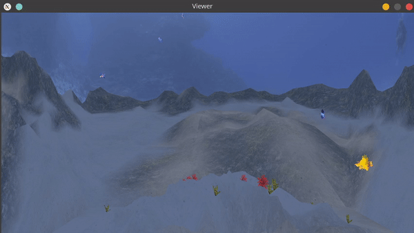

# Paritosh Sharma - Computer Graphics Research  [CV](./CV.pdf)  [Blog](http://blog.paritosh-sharma.com/)

## About Me

I am a grad student at [Université Grenoble Alpes - ENSIMAG, Grenoble, France](https://mosig.imag.fr){:target="_blank" rel="noopener"}. My major field of interest is Graphics, Vision and Robotics. I received my Bachelor's degree from [SRM Institude of Science and Technology](https://www.srmist.edu.in/){:target="_blank" rel="noopener"}.

You can contact me [here](mailto:contact@paritosh-sharma.com)

## Research

My recent research has been in the fields of Computer Graphics and Human Computer Interaction..

### Synthesiser for AZee expressions
My [M2 thesis](https://paritosh-sharma.com/internship-m2/){:target="_blank" rel="noopener"} focuses on animating AZee(a sign language description language) using Blender.
\
\

### Interaction methods for eye tracking for cognitively disabled people
In my M1 thesis, my [work](http://paritosh-sharma.com/gazeplay-interaction/){:target="_blank" rel="noopener"} aims at improving the eye interaction methods for [GazePlay](https://gazeplay.github.io/GazePlay/){:target="_blank" rel="noopener"}.

## Projects

### Simulator for Mass Spring Systems
[Demonstration](https://paritosh-sharma.com/mass-spring-simulator/){:target="_blank" rel="noopener"} of several algorithms for Mass Spring Systems. Such systems are utilised for simulation of cloth and hair particles in computer graphics.
\
\

### Underwater scene using OpenGL
An [underwater scene](https://github.com/Paritosh97/underwater-opengl){:target="_blank" rel="noopener"} implemented using PyOpenGL and GLFW during my course [3D Computer Graphics](https://chamilo.grenoble-inp.fr/courses/ENSIMAG4MMG3D6/){:target="_blank" rel="noopener"}.
\
\

### Mobile VR integration for Godot
During my [GSoC 2018](http://paritosh-sharma.com/gsoc-2018/){:target="_blank" rel="noopener"}, I worked on integrating GearVR and Google DayDream for [Godot Engine](https://godotengine.org/){:target="_blank" rel="noopener"}.

### Unity3D projects
- 3D Mobile VR Painting
- Cricket Game for Oculus Rift and Windows MxR

## Talks

### KDE Akademy 2020
[Talk](https://www.youtube.com/watch?v=-KXb1Vte940){:target="_blank" rel="noopener"} on adding a [Qt3D based backend](http://paritosh-sharma.com/gsoc-2020/){:target="_blank" rel="noopener"} for popular planetarium software [KStars](https://edu.kde.org/kstars/){:target="_blank" rel="noopener"}.

### UGA i-Days 2020
An application idea pitched in the fields of Nutrition, AI, and IoT that aims at solving Vitamin D deficiencies in the elderly. Our team was awarded bronze medal for this idea. For more details, check out the [blog post](http://blog.paritosh-sharma.com/2020-11-07/uga-idays-2020){:target="_blank" rel="noopener"}.
