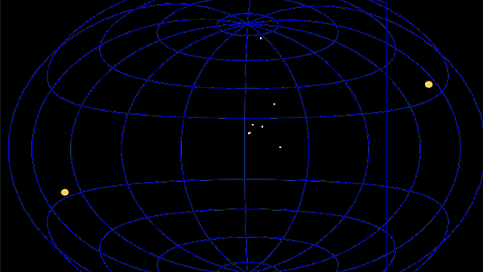

# Paritosh Sharma - Computer Graphics Research  [CV](./CV.pdf)  [Blog](http://blog.paritosh-sharma.com/)

## About Me

I am a grad student at [Université Grenoble Alpes - ENSIMAG, Grenoble, France](https://mosig.imag.fr){:target="_blank" rel="noopener"}. My major field of interest is Graphics, Vision and Robotics. I received my Bachelor's degree from [SRM Institude of Science and Technology](https://www.srmist.edu.in/){:target="_blank" rel="noopener"}.

You can contact me at [here](mailto:contact@paritosh-sharma.com,paritosh.sharma@etu.univ-grenoble-alpes.fr)

## News

I am looking for a position in Computer Graphics. Feel free to contact me.

## Projects

### Differentiable Rendering
[A simple comparison and summary](http://blog.paritosh-sharma.com/2020-10-09/differentiable-rendering){:target="_blank" rel="noopener"} of different types of existing Differentiable Renderers(for example rasterizer, ray marching, point-based techniques and single shaded surfaces). Such systems are utilized in inverse graphics to approximate scene geometry, illumination, materials, and motions from image observations.

### Qt3D based backend for KStars
Advances on adding a [Qt3D based backend](http://paritosh-sharma.com/gsoc-2020/){:target="_blank" rel="noopener"} for popular planetarium software [KStars](https://edu.kde.org/kstars/){:target="_blank" rel="noopener"} with support for astronomical projections.
\
\

### Simulator for Mass Spring Systems
[Demonstration](https://paritosh-sharma.com/mass-spring-simulator/){:target="_blank" rel="noopener"} of several algorithms for Mass Spring Systems. Such systems are utilized for simulation of cloth and hair particles in computer graphics.
\
\

### Underwater scene using OpenGL
An [underwater scene](https://github.com/Paritosh97/underwater-opengl){:target="_blank" rel="noopener"} implemented using PyOpenGL and GLFW during my course [3D Computer Graphics](https://chamilo.grenoble-inp.fr/courses/ENSIMAG4MMG3D6/){:target="_blank" rel="noopener"}.
\
\

### Unity3D projects
- 3D Mobile VR Painting
- Cricket Game for Oculus Rift and Windows MxR

## Work

My recent work has been in the fields of Computer Graphics, HCI and Computer Vision.

### Interaction methods for eye tracking for cognitively disabled people
In my M1 thesis, my [work](http://paritosh-sharma.com/gazeplay-interaction/){:target="_blank" rel="noopener"} aims at improving the eye interaction methods for [GazePlay](https://gazeplay.github.io/GazePlay/){:target="_blank" rel="noopener"}.

### Finger Tracking for Extended Reality
Principles such as nail detection, hand silhouette detection and more utilized to detect fingers in XR games using fixed focus cameras. This can be used with existing game engines like Unity for content creation.

### Mobile VR integration for Godot
During my [GSoC 2018](http://paritosh-sharma.com/gsoc-2018/){:target="_blank" rel="noopener"}, I worked on integrating GearVR and Google DayDream for [Godot Engine](https://godotengine.org/){:target="_blank" rel="noopener"}.

## Talks

### KDE Akademy 2020
[Talk](https://www.youtube.com/watch?v=-KXb1Vte940){:target="_blank" rel="noopener"} on adding a [Qt3D based backend](http://paritosh-sharma.com/gsoc-2020/){:target="_blank" rel="noopener"} for popular planetarium software [KStars](https://edu.kde.org/kstars/){:target="_blank" rel="noopener"}.